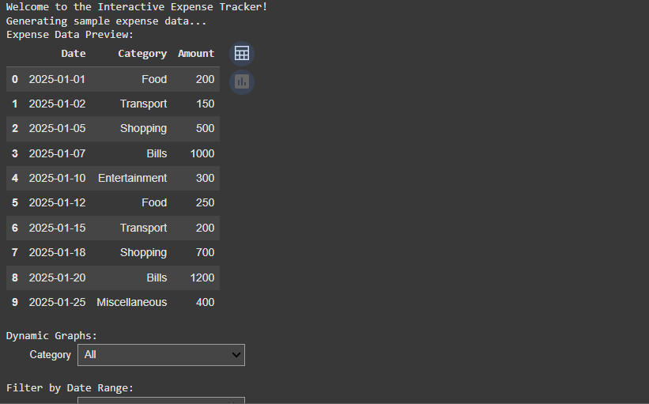
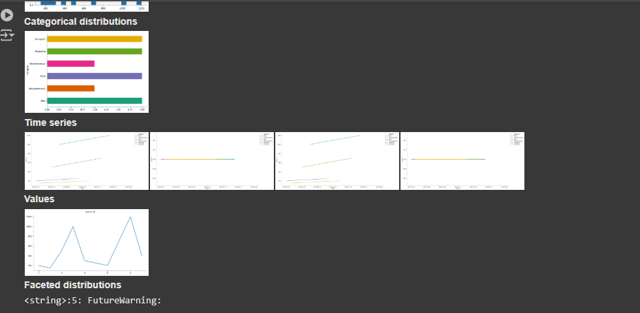
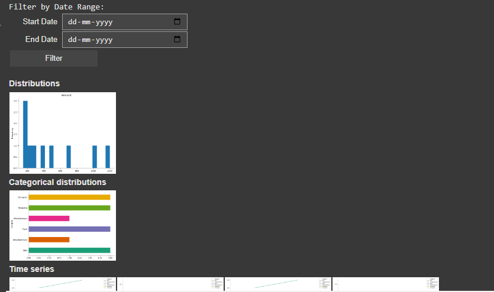
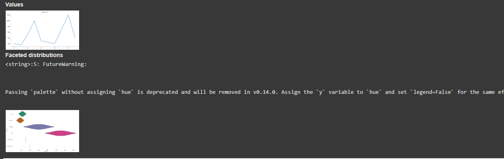

# Expense Tracker with Dynamic Graphs and Interactive UI

This project is an **Interactive Expense Tracker** designed to load, visualize, and analyze expenses dynamically using **Google Colab**. The tool allows users to upload expense data and interactively explore it with dynamic graphs, category filters, and date range filters. This README provides detailed instructions on how to use the project and includes visuals of the UI and features.

---

## Features

1. **Dynamic Visualizations:**
   - Interactive bar and line charts for expense analysis.
   - Categorical and time-series visualizations to understand spending habits.

2. **Filters:**
   - Filter expenses by category.
   - Filter expenses by date range.

3. **Sample Data:**
   - Automatically generates sample expense data (`expenses.csv`) for testing.

4. **User-Friendly Interface:**
   - Intuitive UI with widgets for interaction.
   - Suitable for real-time data exploration.

---

## Prerequisites

1. **Google Colab or Python Environment:** Ensure you have access to Google Colab or a Python setup with the required libraries installed.
2. **Dependencies:** Install the following Python libraries:

   ```bash
   pip install pandas matplotlib plotly ipywidgets
   ```

---

## Setup Instructions

### 1. Clone the Repository
Clone this repository to your local system or upload the Python script to Google Colab.

```bash
git clone https://github.com/your-username/expense-tracker
```

### 2. Run the Script
Execute the script in your Python environment or Google Colab.

### 3. Upload Expense Data
The script generates a sample `expenses.csv` file, but you can also upload your own file with the following structure:

| Date       | Category       | Amount |
|------------|----------------|--------|
| 2025-01-01 | Food           | 200    |
| 2025-01-02 | Transport      | 150    |

- **Date:** Date of the expense in `YYYY-MM-DD` format.
- **Category:** Category of the expense (e.g., Food, Transport, Shopping).
- **Amount:** Amount spent.

### 4. Explore Dynamic Graphs
- Select a category or filter by date range to view specific expense trends.

---

## Visuals

### **1. Dashboard Overview**
This is the main interface displaying the expense data and widgets for interaction:



### **2. Interactive Categorical Distributions**
Visualize the distribution of expenses across different categories:



### **3. Time Series Analysis**
Explore expense trends over time with dynamic line charts:



### **4. Date Range Filtering**
Filter expenses dynamically using date pickers:



---

## How It Works

1. **Data Loading:**
   - Upload `expenses.csv` or use the generated sample data.

2. **Dynamic Visualization:**
   - Select categories or date ranges to update graphs dynamically.

3. **Interactivity:**
   - Use widgets to explore data in real-time.

---

## Future Enhancements

1. **Database Integration:**
   - Store expenses in a database (e.g., SQLite, MongoDB).

2. **Authentication:**
   - Add user profiles to manage multiple users.

3. **Report Generation:**
   - Generate PDF/Excel reports for filtered data.

4. **Mobile App:**
   - Convert this project into a mobile app using Flutter or React Native.

---

## Contributing

Contributions are welcome! Please fork the repository and submit a pull request.


